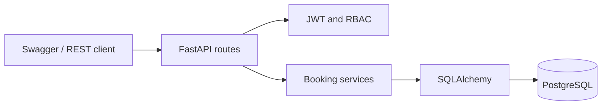
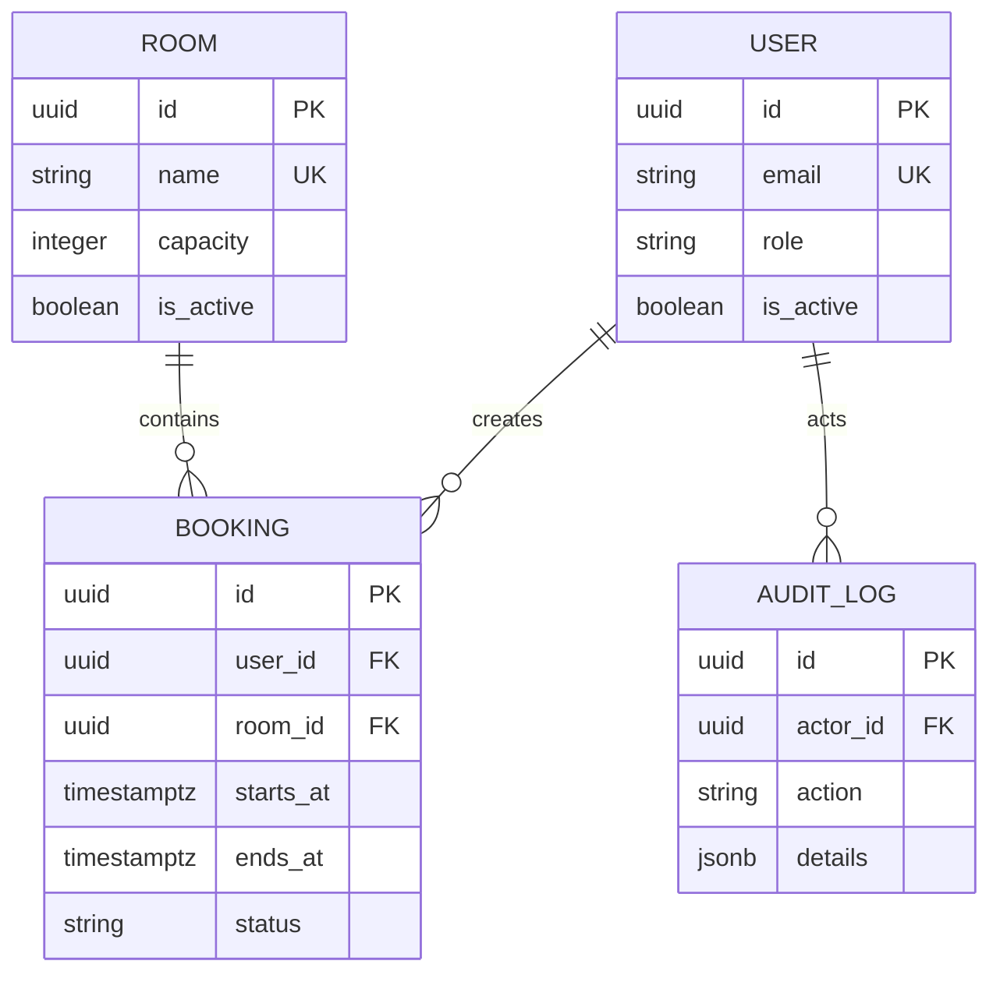

# SlotGuard API

Production-style REST API for booking meeting rooms. SlotGuard demonstrates
authentication, role-based access control, PostgreSQL transactions, audit logs,
pagination and database-level protection against overlapping bookings.

## История проекта

- первоначальная разработка: февраль — октябрь 2023 года (период указан
  приблизительно);
- подготовка и публикация портфолио-версии: август 2026 года.

Репозиторий содержит актуализированную и документированную версию проекта,
подготовленную для публичного портфолио.

## Возможности

- регистрация и JWT-аутентификация;
- роли `user` и `admin`;
- управление переговорными комнатами;
- создание, перенос и отмена бронирований;
- просмотр пользователем только собственных броней;
- административный просмотр всех броней;
- фильтрация и пагинация;
- журнал значимых действий;
- `X-Request-ID` и журналирование HTTP-запросов;
- `/health`, Swagger UI и ReDoc;
- миграции, идемпотентные seed-данные и интеграционные тесты.

## Ключевое бизнес-правило

У активных броней одной комнаты не может быть пересекающихся временных
интервалов. API выполняет раннюю проверку и возвращает `409 Conflict`, а
PostgreSQL дополнительно защищает инвариант с помощью exclusion constraint.
Поэтому два одновременных запроса не смогут создать конфликтующие записи.

Соседние интервалы разрешены: бронь `10:00–11:00` не конфликтует с
`11:00–12:00`. После отмены временной интервал снова доступен.

## Стек

- Python 3.12;
- FastAPI и Pydantic;
- SQLAlchemy 2;
- PostgreSQL 17;
- JWT и RBAC;
- Alembic;
- Docker и Docker Compose;
- pytest, HTTPX2 и Ruff.

## Быстрый запуск

Требуется установленный и запущенный Docker.

```bash
docker compose up --build --detach
```

После запуска:

- Swagger UI: <http://localhost:8010/docs>;
- ReDoc: <http://localhost:8010/redoc>;
- проверка приложения и БД: <http://localhost:8010/health>.

При старте контейнер автоматически применяет миграции и запускает
идемпотентный seed. Локальная учётная запись администратора:

```text
email: admin@example.com
password: ChangeMe123!
```

Это только демонстрационные значения. Для любого внешнего окружения задайте
собственные значения из `.env.example`.

Остановить приложение:

```bash
docker compose down
```

Удалить локальные данные PostgreSQL:

```bash
docker compose down --volumes
```

Последняя команда необратимо удаляет только Docker volume этого проекта.

## Проверки

Интеграционные тесты используют отдельный контейнер PostgreSQL:

```bash
docker compose --profile test up --build \
  --abort-on-container-exit --exit-code-from test test
docker compose --profile test down --volumes
```

Статические проверки локально:

```bash
uv sync --extra dev
uv run ruff format --check .
uv run ruff check .
```

## Основной API-сценарий

1. `POST /api/v1/auth/register` — создать пользователя.
2. `POST /api/v1/auth/login` — получить Bearer token.
3. `GET /api/v1/rooms` — выбрать активную комнату.
4. `POST /api/v1/bookings` — создать бронь.
5. `PATCH /api/v1/bookings/{id}` — перенести бронь.
6. `POST /api/v1/bookings/{id}/cancel` — отменить бронь.

Администратор дополнительно может создавать, редактировать и деактивировать
комнаты. Полный контракт доступен в OpenAPI.

## Архитектура





Подробные решения и сценарии отказа описаны в
[`docs/architecture.md`](./docs/architecture.md).

## Project summary in English

SlotGuard is a containerized FastAPI service for meeting-room reservations. It
uses PostgreSQL, SQLAlchemy, JWT/RBAC, Alembic migrations, audit logs, health
checks and integration tests. A PostgreSQL exclusion constraint preserves the
no-overlap invariant under concurrent requests, while cancelled bookings free
their original time interval.
